# Reservation Website

An easy-to-use way to book a study room at HCMUT for students and a way for managers to manage 🚀

---

## ✨ Features

- 🔐 Security (User authentication, authorization)
- 📅 Booking Study Room
- 🧑‍💼 Manage user information
- 📦 View booking history
- 📝 Send feedback

---

## 🛠️ Technology Stack

| Layer       | Tech Stack                                            |
| ----------- | ----------------------------------------------------- |
| 🔙 Backend  | Java with Spring Framework, Javascript with ExpressJS |
| 🌐 Frontend | HTML, CSS, JavaScript, Bootstrap, React               |
| 🗃️ Database | MySQL                                                 |

## Some picture about website

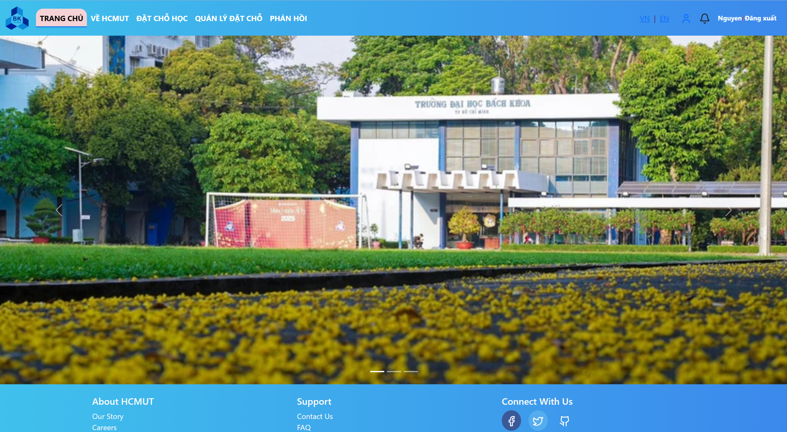

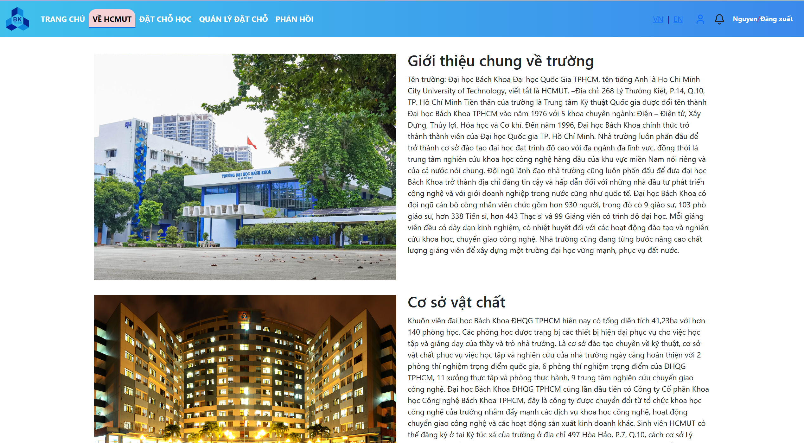

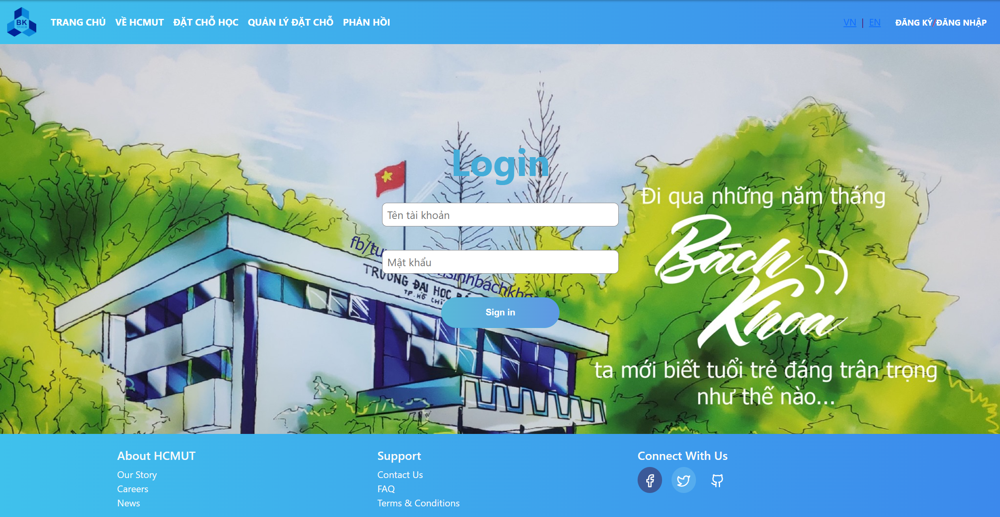

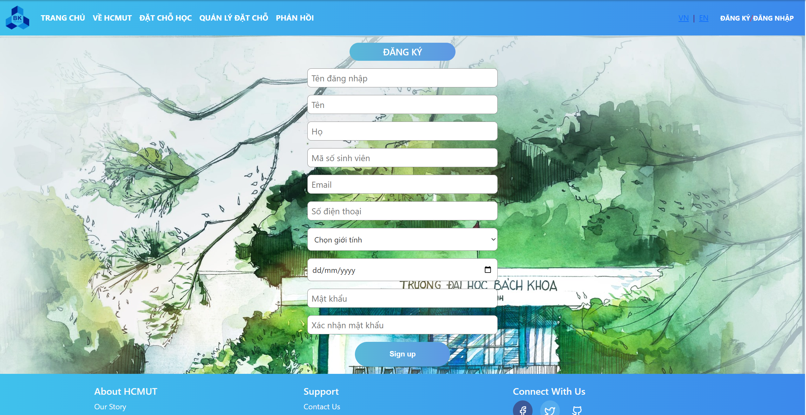

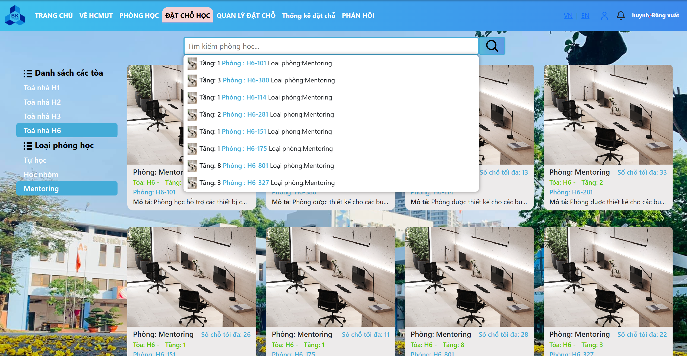

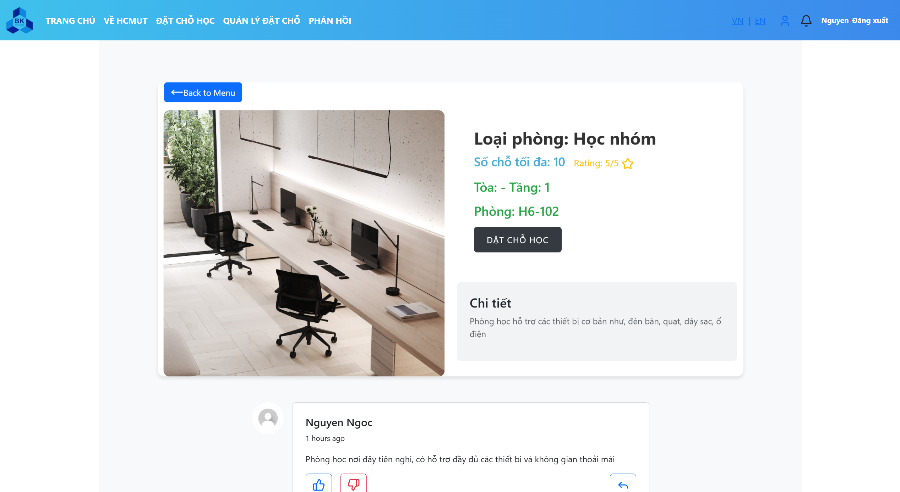

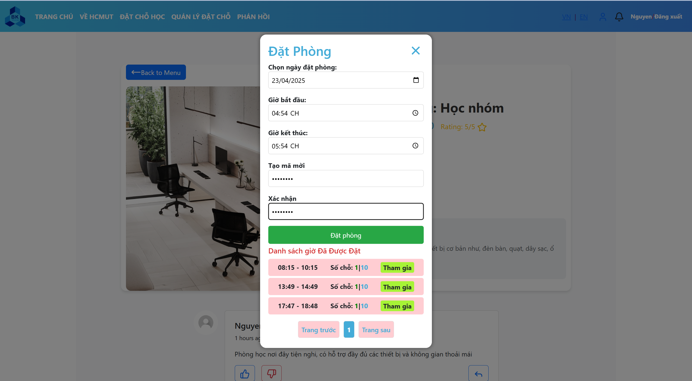

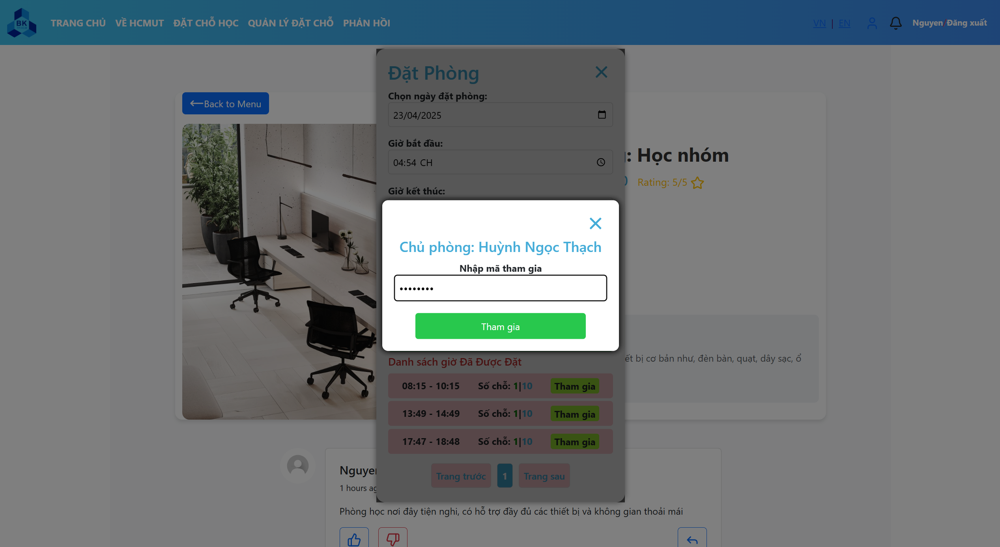

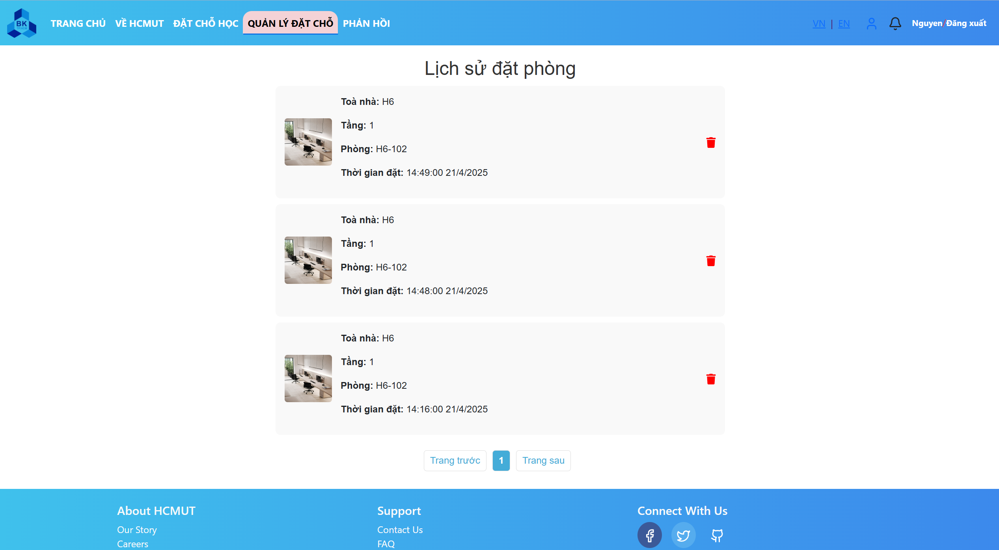

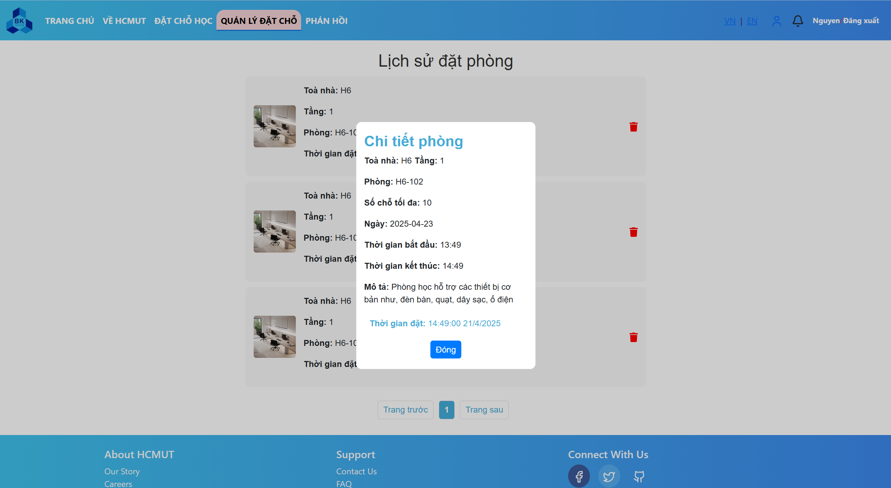

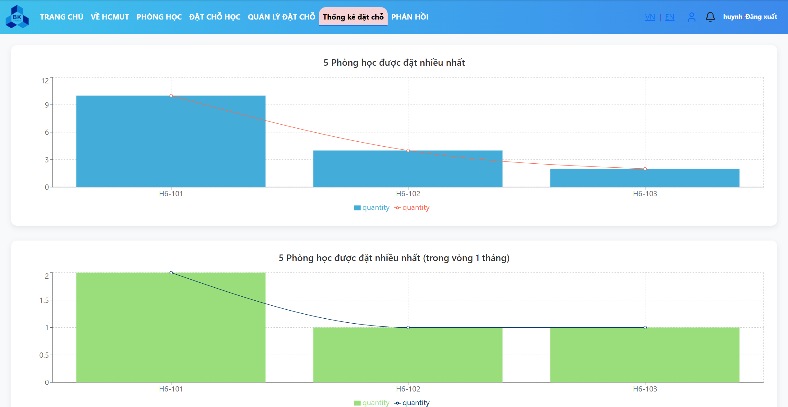

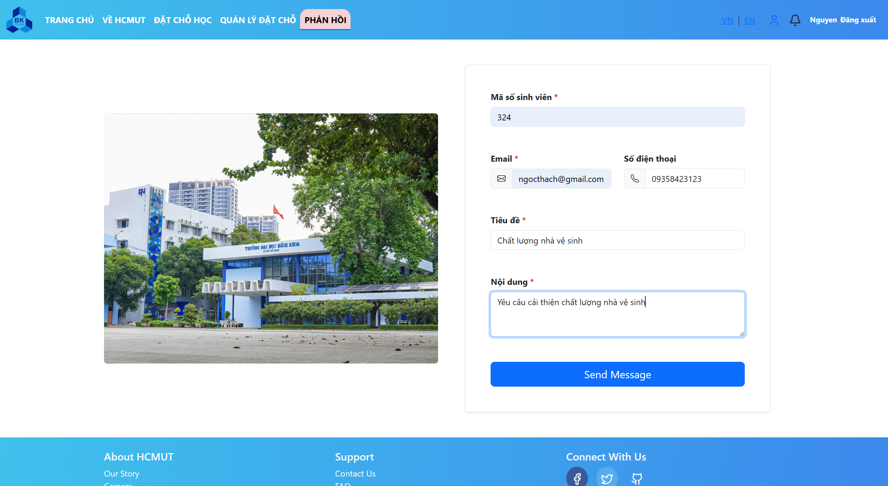

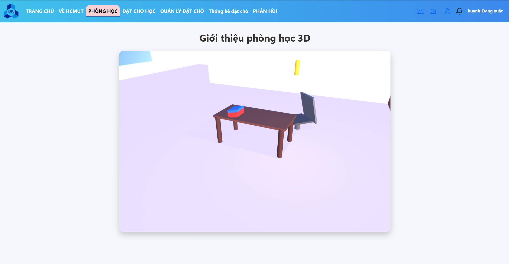

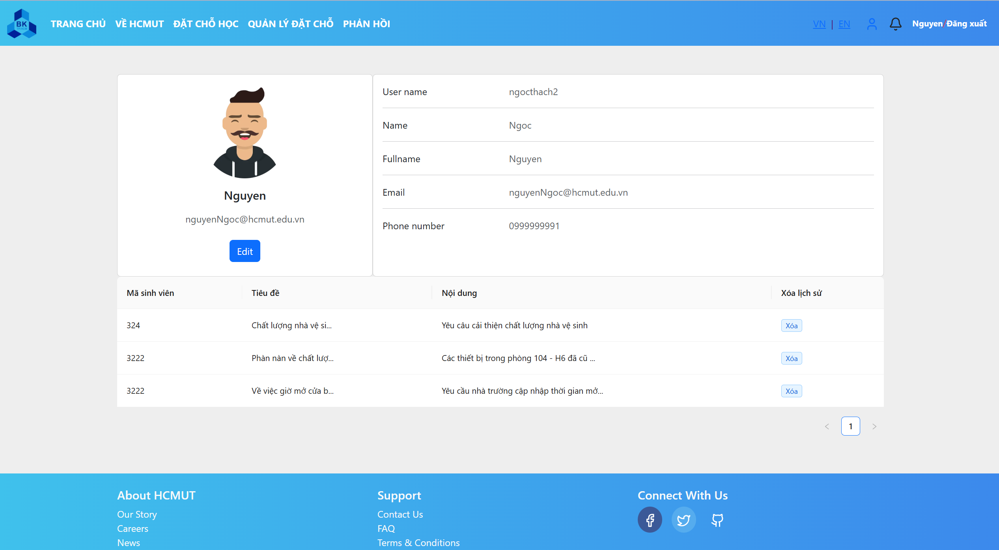

# How to start

## To start projects

To start the project here are the things to do

1. Clone project
2. Run Auth service at backendJava folder
3. Run Booking service at backendJavascript folder
4. Run website with UI at frontend folder

### 1) To clone project

`$ git clone https://github.com/thanhtienly/HCMUT-S3-MRS.git`

### 2) To run services and website with UI

You can follow the README.md file under each folder to run its app.

## 📌 Easier way to run

You can run the microservices and website with UI by using Docker with docker-compose.yml file

The docker-compose.yml file will be provided soon.

## How to start project

### start database

#### roomDatabase

docker run --name roomDatabase -e MYSQL_ROOT_PASSWORD=12345678 -p 3316:3306 -d mysql:latest

#### userDatabase

docker run --name databaseHcmutS3MRS -e MYSQL_ROOT_PASSWORD=12345678 -p 3315:3306 -d mysql:latest

### start backend server

#### to start express

In terminal command line, access to folder backendJavascript
$ npm run start:dev

### start frontend

In terminal command line, access to folder frontend
$ npm i
$ npm start
